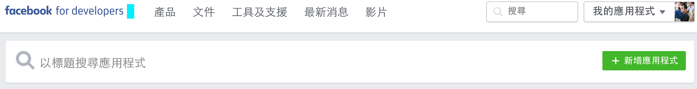
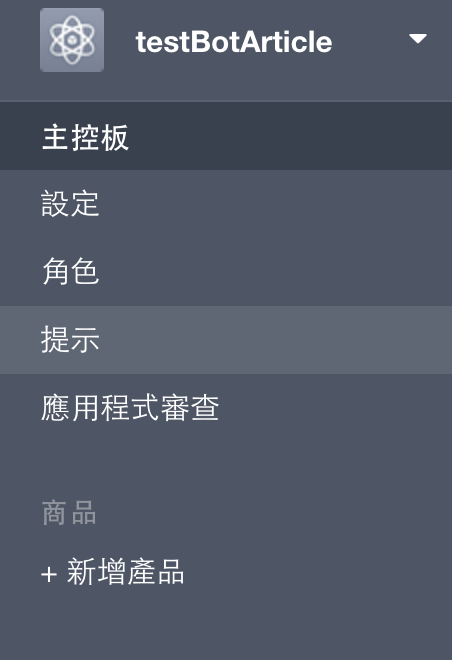
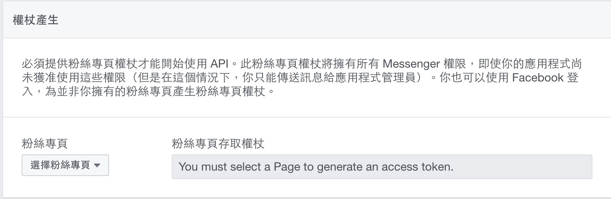
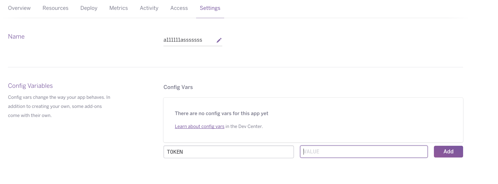
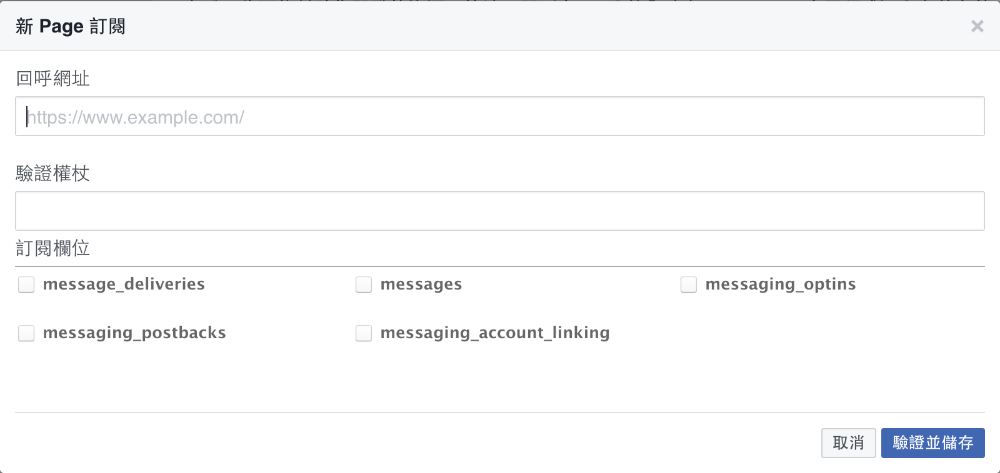
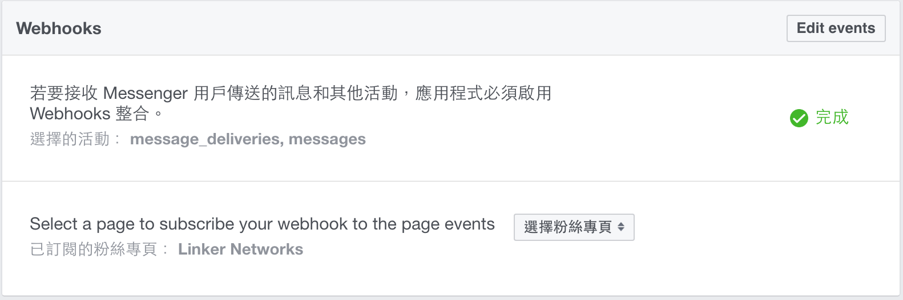
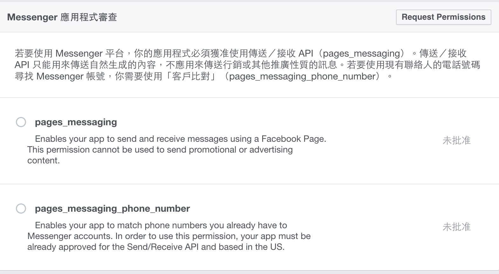
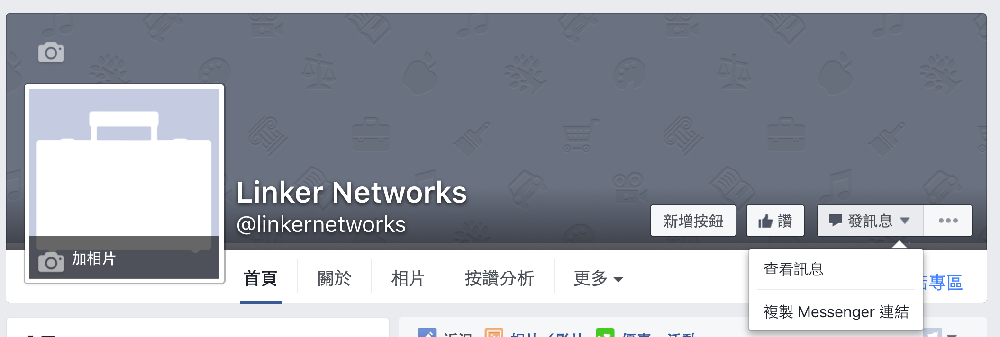
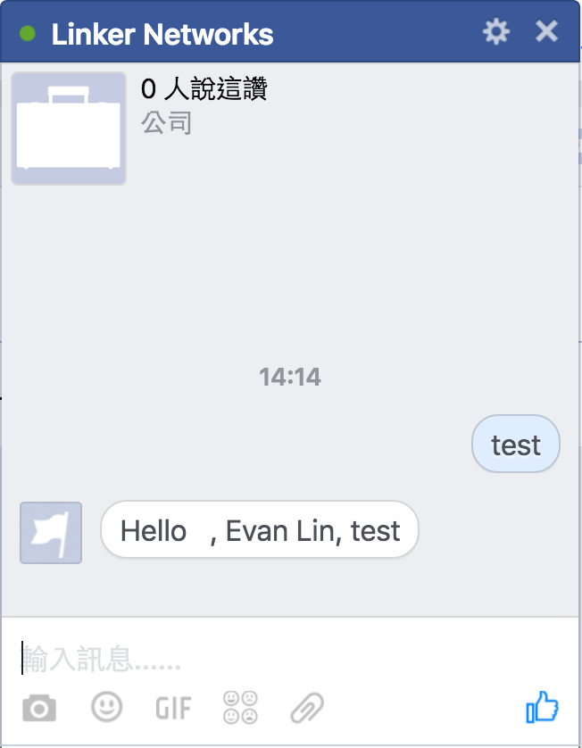

FBBotTemplate: A simple Golang Facebook Bot Template 
==============

   
 
 

Installation and Usage
=============

### 1. Just Deploy the same on Heroku

Remember your heroku ID and app address. ex: `https://APP_ADDRESS.herokuapp.com/`

### 2. Create a Facebook Page

Make sure you already have Facebook account, if you need use FB Bot.

### 3. Go to Facebook Developer to create App

Create App, need select as follow:

- New App type [Web App], create app
- Add new product [Messenger]

### 4. Configuration Messenger Bot

Get token from Faccebook page.

- Select a "Page" you own.
- Go to "Meseenger" product.
- It will generate `token`
- copy it and store it.

### 5. Paste Token to Heroku

Go to heroku dashboard, go to "Setting" -> "Config Variables".

- Add "Config Vars"
- Name -> "TOKEN"
- Value use  `token` facebook app.

### 6. Back Facebook App configuration

- Go to "Messenger" product
- Go to "Setup Webhooks"
- Fill `https://APP_ADDRESS.herokuapp.com/webhook` in callback URL.
- Fill your `token` in "token".
- Checked the checkbox "message_deliveres", "messages".

If your configuration is correct, it will show "completed".

Also remember to choose correct page in this setting.

### 7. Request basic permissions

 
In Messenger application review, press "Request Premission".
 
- Checked the "pages_messaging".

## How to testing it.

- Go to your spcific "page" in Facebook.
- Press "Send Message"

## How to modification your Bot Code

- Download code from Heroku `git clone https://git.heroku.com/APP_ADDRESS.git`
- Modify code on `main.go` first. especially in `MessageReceived()`.
- Commit and push it back to heroku `git push heroku master`.

Inspired By
=============

- [Provides a GO SDK for Facebook's messenger-platform](https://github.com/maciekmm/messenger-platform-go-sdk)
- [FB: Messenger Platform/Getting Started](https://developers.facebook.com/docs/messenger-platform/quickstart/)
- [[教學] Facebook Messenger API](http://huli.logdown.com/posts/709641-teaching-facebook-messenger-api)
- [用Python開發Facebook Bot](https://medium.com/dualcores-studio/%E7%94%A8python%E9%96%8B%E7%99%BCfacebook-bot-26594f13f9f7#.bunklnnue)

License
---------------

Licensed under the Apache License, Version 2.0 (the "License");
you may not use this file except in compliance with the License.
You may obtain a copy of the License at

http://www.apache.org/licenses/LICENSE-2.0

Unless required by applicable law or agreed to in writing, software
distributed under the License is distributed on an "AS IS" BASIS,
WITHOUT WARRANTIES OR CONDITIONS OF ANY KIND, either express or implied.
See the License for the specific language governing permissions and
limitations under the License.

